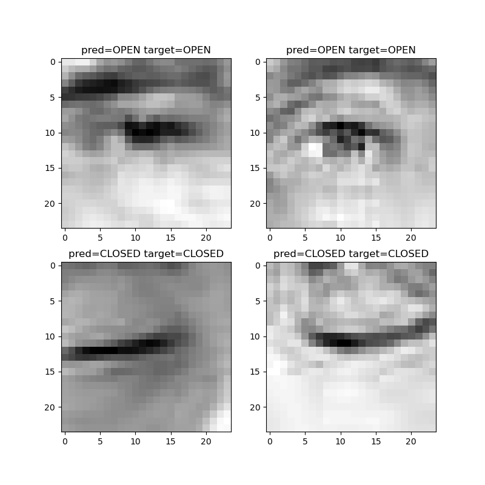
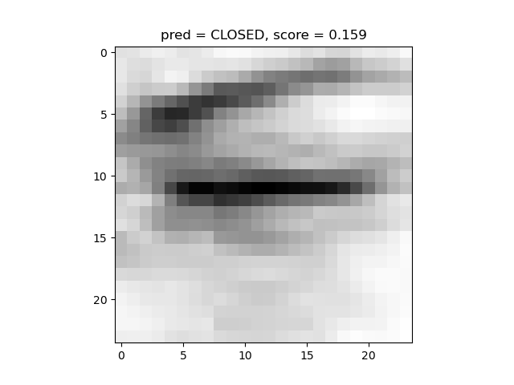

# Self-supervised eyes classification

## Motivation

Image classification is a well-known pattern recognition and computer vision problem, which imply assigning an image to 
one of the pre-defined classes. Multiple supervised approaches are used in order to solve this problem. In that case, 
a model is trained with image-label pairs. Widely used approaches in image processing are based on convolutional 
neural networks (CNN), which are able to effectively solve the problem of image classification and recognition. 
However, what happens if the labels are not available during training? This situation is closer to real life, 
e.g. there are a lot of unlabelled data on the Web, medical data etc. In this case, we have to deal with the problem 
of clustering based on inherited image similarities. Semi-supervised and unsupervised approaches have been introduced 
in order to detect these similarities 

## Problem

In this project, we classify open and closed human eyes presented in a dataset. The dataset includes 4000 images without labels. 
Thus, we solve the binary classification problem with unlabelled data. The goals of this project:

1. Research the problem of limited size of annotated dataset.
2. Implement an approach based on VAE to classify images with eyes where the final score [0,1], i.e. 0.0 - closed, 1.0 - open.
3. Examine the clustering possibilities of VAE in the latent space

## Approach

The approach consists of two stages. 

* **Stage I:**  We train VAE in an unsupervised manner, i.e. VAE accepts an image as an input and tries to reconstruct this image minimizing loss function. 


* **Stage II:**  we use the pre-trained VAE encoder for the supervised training. For this purpose, we manually annotated 100 samples from the dataset. We freeze the encoder and add one neuron with sigmoid activation function to enable binary classification. 
We set cls_threshold = 0.5. Thus, if the predicted value < 0.5, then the predicted label is "CLOSED", otherwise "OPEN". 

The full description of this project with results are available in [Notebook](Notebook.ipynb). Some prediction examples:

<p align="center">

</p>

Here you can find a guide how to run the project. 

## Step 1: Setup

1. Create conda environment with [environment.yml](environment.yml):
```python
conda env create -f environment.yml
```
2. Activate conda environment, see the [link](https://docs.conda.io/projects/conda/en/latest/user-guide/tasks/manage-environments.html#creating-an-environment-from-an-environment-yml-file)
for help.
```python
# For Linux:
$ conda activate
$ source activate <env_name>
```

3. Set up project directories

Project tree may look like this: 
```
    project_root
    | ---- eyes-classification
    |      |----data_dir
    |      |        EyesData.zip
    |      |        targets.json
    +      |----output_dir  
    |      |        #...trained models
    +      |--- logs_dir
    |      |        ... 
    |      |--- configs
    |      |        ...
    |      |--- utils
    |      |        ...
    |      |--- ...
``` 

For this project tree specify paths in [data_config.py](configs/data_config.py):

```python

# folder containing targets.json and EyesDataset.zip
data_dir = ' eyes-classification/dataset/'
# to save results of training
output_dir = ' eyes-classification/output/'
# to save logs
logs_dir = ' eyes-classification/logs/'

```
Output and log directories will be created during training. 

## Step 2: Training

### Stage I: VAE

1. If you want to change VAE training parameters, set up [vae_config.py](configs/vae_config.py). 
2. Run [train_vae.py](train_vae.py):
```python
python3 train_vae.py 
```
3. The results (config, images, model) will be saved in the directory: `root/output_dir/vae/vae_<timestep>`

### Stage II: Classifier

1. If you want to change classifier training parameters, set up [cls_config.py](configs/cls_config.py)
2. Specify path to the folder with the pre-trained VAE, e.g.
```python
pretrained_vae = 'vae_20211106-152325'
```
3. Run [tran_classifier.py](train_classifier.py):

```python
python3 train_classifier.py 
```

4. The results will be saved in the directory: `root/output_dir/cls/cls_<timestep>`

## Step 3: Inference 
**Inference can be run w/o steps above.**

We use `class OpenEyesClassificator(nn.Module)` for inference. 

1. Specify paths for inference in [cls_config.py](configs/cls_config.py):

```python
model_path = 'eyes-classification/output/cls/cls_6200_20211108-202409.pth'
abs_image_path = 'absolute/path/to/image/image.jpg'
```
where `/path/to/model/` is the path after project root.

2. Run [inference.py](inference.py):

```python
python3 inference.py 
```
3. The program prints the score from 0 to 1 and  plots the image with a prediction. 
The results will be saved in the directory: `root/output_dir/inference/inference_<timestep>`. For example:

[comment]: <> (![image]&#40;images/test2.png&#41;)

<p align="center">

</p>
